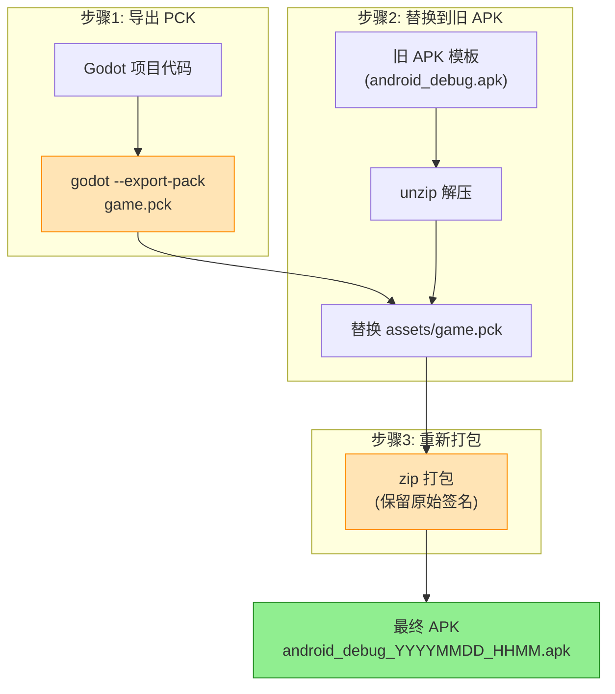

# Slay The Robot APK 打包流程

## 当前方案（已验证可用）



## 关键步骤

### 1. 导出 PCK
```bash
cd ~/openclaw/workspace/game/Slay-The-Robot
godot --headless --export-pack "Android" "builds/android/game.pck"
```

### 2. 替换到旧 APK（保留签名）
```bash
cd builds/android

# 复制旧 APK 并解压
cp "/Users/roger/Google 云端硬盘/apk/Slay-The-Robot/android_debug.apk" old.apk
unzip -q old.apk -d extracted

# 替换 game.pck
cp game.pck extracted/assets/game.pck

# 重新打包（保留 META-INF 签名）
cd extracted
zip -rq ../final.apk .
```

### 3. 关键发现

| 方法 | 结果 |
|------|------|
| `apksigner sign` | ❌ 签名变成 Android Debug |
| `zip` 直接打包 | ✅ 保留原始 Godot 签名 |

## 一键脚本

```bash
# scripts/build_android_manual.sh
```

## 问题排查

| 问题 | 原因 | 解决方案 |
|------|------|----------|
| 安装失败 | 签名不一致 | 用旧 APK 保留原始 Godot 签名 |
| pck 位置错误 | 模板结构 | game.pck 放到 `assets/` 文件夹 |
| Manifest 错误 | 用了模板默认 | 从旧 APK 提取 AndroidManifest.xml |
